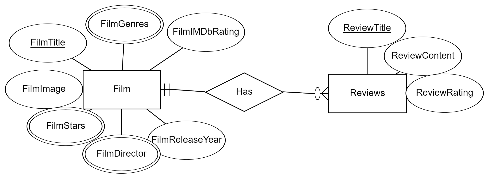

# IMDb Top 250 Movies Scraper

## Introduction

This project involves comprehensive web scraping of IMDb's Top 250 movies using Selenium and Python. The objective is to gather detailed data on each movie, including extensive user reviews. The data collected includes movie details such as ratings, release year, genre, director, movie image, and stars (cast). Additionally, we scrape and analyze extensive user reviews for these movies. The scraped data is stored in a CSV file for further analysis.

Web scraping IMDb with Selenium offers several advantages. Selenium mimics realistic user interactions, handles dynamic content and AJAX requests effectively, fully renders pages with heavy JavaScript usage, and navigates through complex web elements. This approach ensures comprehensive and accurate data capture, which is crucial for detailed analysis.

## Scraping

Using Selenium for web scraping IMDb offers several advantages:

1. **Realistic Interaction**: Selenium mimics user interaction, handling dynamic content and AJAX requests effectively, which can be challenging with simple HTTP requests.
2. **JavaScript Rendering**: Selenium fully renders pages with heavy JavaScript usage or dynamic content loading, ensuring comprehensive data capture.
3. **Handling Dynamic Content**: Explicit waits (`WebDriverWait`) in Selenium ensure elements are fully loaded before scraping, maintaining data integrity.
4. **Complex Navigation**: Selenium facilitates navigation through multiple pages and interaction with various elements like dropdowns and forms.
5. **Visual Feedback**: Operating in a browser instance provides visual verification of the scraping process, aiding in debugging and ensuring accuracy.
6. **Politeness Factor**: Selenium allows controlled interaction to avoid server overload, adhering to ethical scraping practices.

## Features

- **Scrapes top-rated movies from IMDb**: Fetches movie details from the IMDb top 250 movies chart.
- **Stores data in a CSV file**: All the scraped data is stored in a well-structured CSV file for easy access and analysis.
- **Detailed movie information**: Collects comprehensive details about each movie, including title, rating, release year, image, genre, directors, and full cast.
- **Scrapes all the user given reviews for analysis**: It fethces all the user given reviews so it could be used in any ML sentemeint analysis problem or classification problem.

## Before-processing of the Data

Post-scraping, the data underwent thorough processing and analysis:

- **Initial Data Structure**:
  

## After-Processing of the Data


## How to Use

### Prerequisites

- Python 3.x
- Required Python libraries: `os`, `time`, `pandas`, `selenium`, `tqdm`

You can install the required libraries using pip:
```bash
pip install selenium pandas tqdm
```
